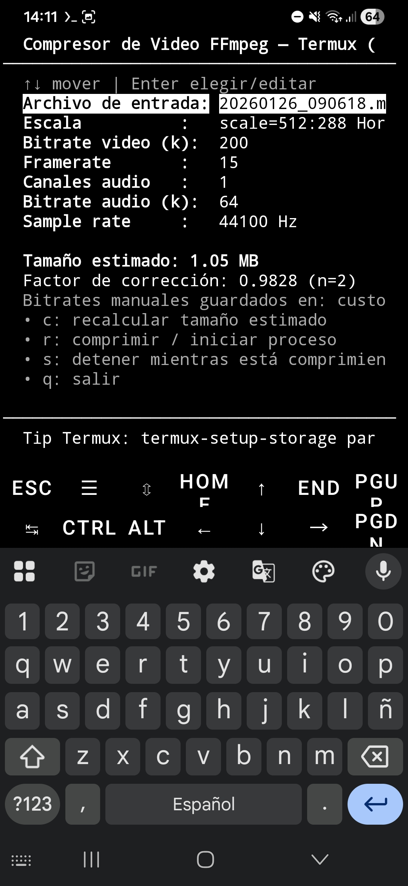
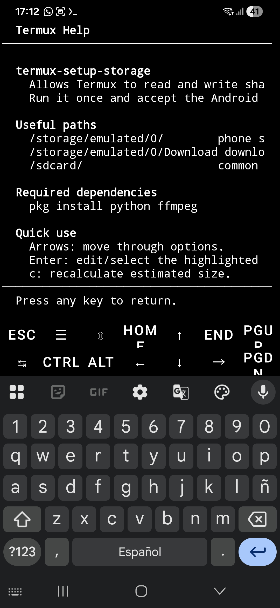

# FFmpeg Video Compressor TUI (Termux) - v3

Video compressor for **Android using Termux**, built with **Python + FFmpeg + a text interface (curses)**. but also working under Linux Terminal.

This program reduces video size by adjusting quality, resolution, and audio settings, which is useful for sharing videos through WhatsApp, Telegram, and other apps. On startup, it lets you choose the interface language: **English** by default or **Español**.

**Spanish documentation:** if you prefer Spanish, read [README_ES.md](README_ES.md).

# Use Case

I had a 900 MB video on my phone that I wanted to upload to WhatsApp, but WhatsApp showed a message saying it would trim the video down to 180 MB. The video was 10 minutes long, and trimming it would have shortened it. With this program, I reduced it to less than 180 MB while watching the estimated final size as I adjusted the parameters. After compressing it, I could send the complete video and WhatsApp did not ask me to trim it.

---

## What Is This Program?

It is an application that runs **inside the terminal**. It does not use a graphical window. It lets you:

- Choose the startup language: English or Spanish
- Search for videos with a file picker inside Termux
- Change video resolution
- Adjust video and audio quality through bitrate settings
- See the approximate estimated final size
- Open built-in Termux help
- Compress the video

---

## Requirements

This program is designed for **Android + Termux**, but also working on Linux.

### 1. Install Termux

Install Termux from F-Droid.

**Note**: Some Xiaomi phones may also include an updated full Termux version.

Doesn't use the Termux version that come in Play Store because it's not a full version.

### 2. Install Dependencies Inside Termux

Open Termux and run:

```bash
pkg update
pkg upgrade
pkg install git python ffmpeg
```

Then run:

```bash
termux-setup-storage
```

That last command allows Termux to access the phone storage.

---

## Accessing Internal Storage

To allow Termux to access internal storage, run:

```bash
termux-setup-storage
```

Press Enter and accept the Android permission prompt.

To clone a repository into internal storage, first navigate there. In Termux, run:

```bash
cd storage
```

Then run:

```bash
ls
```

to see the available folders.

Then enter shared storage:

```bash
cd shared
```

Shortcut: you can do the same thing with:

```bash
cd /sdcard
```

Either method takes you to shared internal storage.

To check your current location in Termux, run:

```bash
pwd
```

and press Enter.

**Note:** When you open Termux for the first time, you start in the Termux home folder:

```text
/data/data/com.termux/files/home
```

If you are already in internal storage through `cd shared`, the prompt may look like:

```text
~/storage/shared $
```

If you used `cd /sdcard`, it may look like:

```text
/sdcard $
```

> **Note:** It is important to know where you are. If you accidentally cloned a repository inside the Termux home folder or inside `storage`, you can move it with `mv`. If you are in `/data/data/com.termux/files/home` and cloned a repo named `myrepo`, first move it to `storage` with `mv myrepo storage`, then move it to shared internal storage with `mv myrepo shared`. If you cloned it directly inside `storage`, use `mv myrepo shared`. If you are in `shared` and want to return to the Termux home folder, run `cd`.

## How to Run the Program

1. Clone or download this repository within the Internal Storage to which it is taken thanks to  /sdcard 
2. Enter the repository folder from Termux with `cd` following the name of the repository 
3. Run:

```bash
python ffmpegcompressor.py
```

When it opens, the language selector appears first. **English** is selected by default; use the arrows to choose **Español** if you prefer, then press **Enter**.

## Screenshot



## Built-In Help

In the main menu, move down with the arrows until:

```text
Termux Help build in | Enter view
```

Press **Enter** to open built-in help inside the terminal. It explains:

- Main compressor keys
- Why the default compression values were chosen
- Available presets and old WhatsApp compression examples
- Local configuration files

Use **Up/Down** to scroll. To return to the main menu, press **q**, **ESC**, or **Enter**.



---

## Program Controls

| Key       | Function                                  |
| --------- | ----------------------------------------- |
| Up / Down | Move between options                      |
| Left / Right | Decrease/increase the selected value  |
| **Enter** | Select/edit the highlighted option        |
| **c**     | Recalculate estimated size                |
| **f**     | Search video with the file picker         |
| **r**     | Compress video / start process            |
| **s**     | Stop while compressing                    |
| **q**     | Exit                                      |

---

## How to Load a Video

After choosing the language, the file picker appears.

You can navigate with the arrows:

- **Up / Down**: move through folders and videos
- **Enter**: open a folder or choose a video
- **q** or **ESC**: cancel

A simple way to use it is to place the video inside the repository folder:

```text
whatsapp-termux-video-compressor
```

Then open the program and choose the video from the file picker.

After choosing the video, press **c** to recalculate the estimated size if you change parameters, **r** to start compression, and **s** to stop while it is compressing.

---

## Parameters You Can Change

For numeric values, **Left** decreases and **Right** increases. This applies to video bitrate, framerate, audio channels, audio bitrate, and audio sample rate.

### Scale

Changes the video resolution:

- Horizontal / Landscape: normal format
- Vertical / Portrait: for TikTok / Reels style videos

For **Scale**, the left/right arrows switch between the available options.

When **Scale / Escala** is highlighted, you can switch between `scale=512:288` and `scale=288:512` with **Left / Right** or by pressing **Enter**.

### Video Bitrate

Controls video quality.
Higher value = better quality = larger file.

### Audio

You can change:

- Channels: mono or stereo
- Audio bitrate
- Sample rate

---

## Why These Defaults?

The program starts with these values:

| Parameter | Default value | Practical reason |
| --------- | ------------- | ---------------- |
| Scale | `scale=512:288` | Reduces resolution to strongly reduce video size. |
| Video bitrate | `200k` | Keeps acceptable quality on a phone screen without making the file too large. |
| Framerate | `15` | Reduces frames per second and lowers final size. |
| Audio channels | `1` | Uses mono audio; for voice or casual videos, it is often enough and smaller than stereo. |
| Audio bitrate | `64k` | Gives more audio quality than the older 18k-30k tests while still staying light. |
| Sample rate | `44100 Hz` | Common and compatible audio frequency. |

These values come from older manual FFmpeg/FFmulticonverter tests [made by me](https://gist.github.com/wachin/643b01ece5724ceba23d3408db53db28) to send videos through WhatsApp when the limit was much smaller, around **16 MB**. Those tests used commands like:

```bash
-vf "scale=512:288" -b:v 200k -r 15 -ac 1 -b:a 30k -ar 44100
```

The idea was always the same:

- Reduce resolution with `scale=512:288`.
- Lower video bitrate to control size.
- Use `15 fps` to reduce frames per second.
- Convert audio to mono with `-ac 1`.
- Use a low audio bitrate.
- Keep `44100 Hz` for compatibility.

Today WhatsApp allows larger video files, so this program uses slightly more comfortable defaults, especially for audio (`64k` instead of 18k-30k). Even so, the defaults are still a good starting point because they compress a lot without forcing you to calculate everything from scratch.

If the video is still too large, lower the **video bitrate** first. If you still need to reduce more, try lowering the **audio bitrate** or using a lower video value. Then press **c** to recalculate the estimated size.

---

## Manual Bitrate (Advanced)

You can type any bitrate:

1. Move to **Video bitrate** or **Audio bitrate**.
2. Press **Enter**.
3. Type the number.
4. It is saved permanently.

These values are saved in:

```text
custom_bitrates.json
```

---

## How Many Video Formats Does It Accept?

The program does not really limit formats.
**FFmpeg** handles that.

FFmpeg supports almost every common video format.

### Common Formats FFmpeg Usually Supports

| Type     | Common formats          |
| -------- | ----------------------- |
| Mobile   | MP4, 3GP, MOV           |
| PC       | AVI, MKV, WMV           |
| Internet | WEBM, FLV               |
| TV/HD    | MPEG, MPG, TS, MTS, M2TS |
| Cameras  | MOV, MTS, MXF           |

---

### Why So Many?

Because the program simply runs:

```bash
ffmpeg -i file
```

and FFmpeg detects the format automatically.

---

## Estimated Size Calculation

The program estimates how large the video will be before compressing.

It also learns over time using:

```text
correction_factor.json
```

Each conversion improves the estimate precision.

Format:

```json
{
  "factor": 1.08,
  "n": 0
}
```

- `factor`: multiplier used to adjust the estimate.
- `n`: number of conversions used to calculate that factor.

This file is not uploaded to GitHub because it is generated by the program and depends on conversions made on each phone.

---

## Ignored Local Files

These files are stored locally but excluded in `.gitignore`:

```text
correction_factor.json
custom_bitrates.json
```

Both contain generated data or personal user preferences:

- `correction_factor.json`: changes after compressing videos and adjusts estimates based on real results.
- `custom_bitrates.json`: saves manual bitrates added by the user.

To document the format without uploading local data, the repository includes:

```text
correction_factor.example.json
custom_bitrates.example.json
```

Format of `custom_bitrates.json`:

```json
{
  "video": [275],
  "audio": [72]
}
```

- `video`: list of custom video bitrates in kbit/s.
- `audio`: list of custom audio bitrates in kbit/s.

---

## Output Files

Videos are never overwritten.

Example:

```text
video.mp4
video_compressed.mp4
video_compressed_1.mp4
video_compressed_2.mp4
```

---

## Technologies Used

- Python
- FFmpeg
- curses text interface
- Termux on Android

---

## Author

Educational project for video compression on Android using free tools.

- Washington Indacochea Delgado

Under 

---

God Bless You

---
