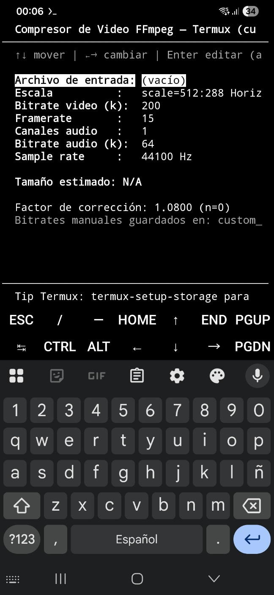

# FFmpeg Video Compressor TUI (Termux) – v3

Compresor de videos para **Android usando Termux**, hecho en **Python + FFmpeg + interfaz de texto (curses)**.

Este programa permite reducir el tamaño de un video ajustando calidad, resolución y audio, ideal para compartir por WhatsApp, Telegram u otras apps.

# Caso de uso
Yo tengo un vídeo en mi celular de 900 MB que lo quería subir a WhatsApp, pero este me mostró un mensaje que decía que WhatsApp lo iba a recortar hasta dejarlo en 180MB (tenía de duración 10 minutos y si hacía eso lo iba a dejar en menos tiempo), y con este programa lo dejé a menos de 180 MB observando el tamaño aproximado al que iba quedando cuando le iba ajustando los parámetros, y lo comprimí y lo pude enviar completo y WhatsApp no me preguntó nada (o sea no fue necesario recortar el vídeo a menos de 10 minutos, sino que, reduciendo su tamaño a menos de 180 MB pude enviarlo completo).

---

## ¿Qué es este programa?

Es una aplicación que funciona **dentro de la terminal** (no tiene ventanas gráficas) y permite:

✅ Escribir el nombre de un video que esté en el directorio (a mano)  
✅ Cambiar resolución  
✅ Ajustar calidad de video y audio (bitrate)  
✅ Ver el tamaño estimado aproximado final  
✅ Comprimir el video  

---

## ¿Qué necesitas antes?

Este programa está pensado para **Android + Termux**.

### 1️⃣ Instalar Termux

Desde F-Droid

### 2️⃣ Instalar dependencias dentro de Termux

Abre Termux y escribe:

```bash
pkg update
pkg upgrade
pkg install python ffmpeg
termux-setup-storage
```

Ese último comando permite acceder a la memoria del teléfono.

---

## Cómo ejecutar el programa

1. Clona o descarga este repositorio
2. Entra a esa carpeta desde Termux.
3. Ejecuta:

```bash
python ffmpegcompressor.py
```

## 📸 Captura de pantalla



---

## Controles del programa

| Tecla     | Función                                  |
| --------- | ---------------------------------------- |
| ↑ ↓       | Mover entre opciones                     |
| ← →       | Cambiar valor de la opción               |
| **Enter** | Editar archivo o escribir bitrate manual |
| **c**     | Calcular tamaño estimado                 |
| **r**     | Comprimir video                          |
| **s**     | Detener compresión                       |
| **q**     | Salir                                    |

---

## Como cargar el video

En tu administrador de archivos, que puede ser el del teléfono u otro que hayas descargado, ejemplo a mí me gusta usar  Mixplorer, coloca un vídeo en está carpeta: 

 whatsapp-termux-video-compressor
  
 y allí veo cuál es el nombre del archivo con su extensión y lo copio tal cual está, ejemplo: 

20260201 Video.mp4

Y vuelvo a Termux y doy **Enter** en: 

Archivo de entrada: (vacío)

Y aparecerá el foco del cortador encima de: 

Tamaño estimado: N/A

allí escribir ese nombre y presiona "c" para calcular el tamaño estimado, y "r" para iniciar la compresión, y "s" para detener, y si deseas cambiar algún valor sigue leyendo:

---

## Parámetros que puedes cambiar

### Escala

Cambia la resolución del video:

* Horizontal → formato normal
* Vertical → para videos tipo TikTok / Reels

### Bitrate de video

Controla la calidad del video.
Más alto = mejor calidad = archivo más grande.

### Audio

Puedes cambiar:

* Canales (mono o estéreo)
* Bitrate de audio
* Frecuencia (sample rate)

---

## Bitrate manual (¡función avanzada!)

Puedes escribir cualquier bitrate:

1. Ponte sobre **Bitrate video** o **Bitrate audio**
2. Presiona **Enter**
3. Escribe el número
4. Se guarda para siempre

Estos valores se guardan en:

```
custom_bitrates.json
```

---

## ¿Cuántos formatos de video acepta este programa?

Realmente **no limita formatos**.
Quien manda aquí es **FFmpeg**.

FFmpeg Acepta **casi todos los formatos de video que existen**.

### 📌 Ejemplos de formatos que FFmpeg suele soportar:

| Tipo        | Formatos comunes         |
| ----------- | ------------------------ |
| 📱 Móvil    | MP4, 3GP, MOV            |
| 💻 PC       | AVI, MKV, WMV            |
| 🌐 Internet | WEBM, FLV                |
| 📺 TV/HD    | MPEG, MPG, TS, MTS, M2TS |
| 🎥 Cámaras  | MOV, MTS, MXF            |

---

### ¿Por qué acepta tantos?

Porque el programa solo hace:

```bash
ffmpeg -i archivo
```

Y FFmpeg detecta el formato automáticamente.

---

## Cálculo de tamaño estimado

El programa calcula cuánto pesará el video antes de comprimir.

Además, aprende con el tiempo usando:

```
correction_factor.json
```

Cada conversión mejora la precisión del cálculo.

---

## Archivos de salida

Nunca se sobrescriben videos.

Ejemplo:

```
video.mp4
video_compressed.mp4
video_compressed_1.mp4
video_compressed_2.mp4
```

---

## Tecnologías usadas

* 🐍 Python
* 🎥 FFmpeg
* 🖥 curses (interfaz de texto)
* 📱 Termux (Linux en Android)

---

## ¿Para qué sirve aprender con este proyecto?

Este programa enseña:

✔ Manejo de archivos
✔ Uso de procesos externos (FFmpeg)
✔ Interfaces de texto
✔ Cálculo de tamaños digitales
✔ Automatización
✔ Persistencia con JSON

Es un excelente ejemplo de proyecto práctico de informática.

---

## Autor

Proyecto educativo para compresión de video en Android usando herramientas libres.

- Washington Indacochea Delgado

---
